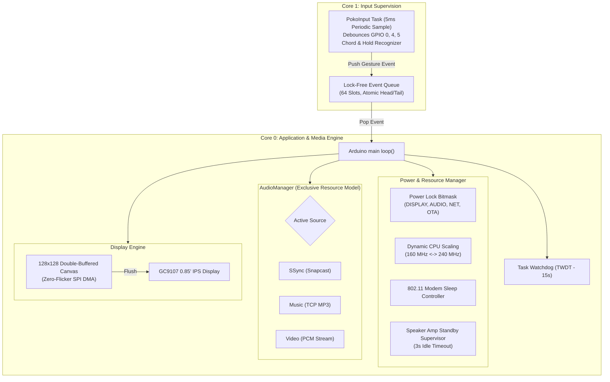
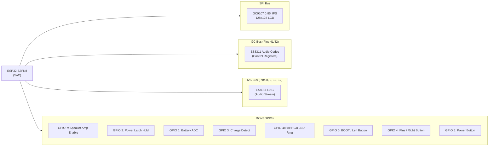
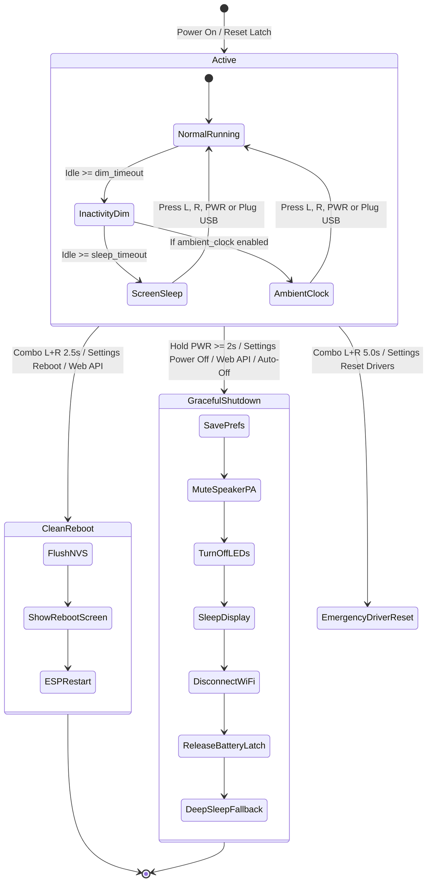
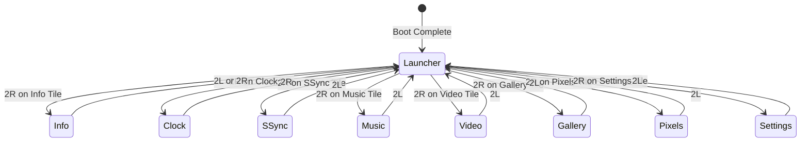

# PoKo Microcontroller & Device Manual

> **Comprehensive Technical Guide, Firmware Behavior, Application Suite & Operating Reference**  
> Target Hardware: **Waveshare ESP32-S3-LCD-0.85** (ESP32-S3FN8 / Dual-Core 240 MHz / 8 MB Flash / 8 MB OPI PSRAM)  
> Firmware Version: **v1.3.3**

---

## Table of Contents

1. [Microcontroller Architecture & System Behavior](#1-microcontroller-architecture--system-behavior)
   - [Dual-Core Task Distribution & Concurrency](#dual-core-task-distribution--concurrency)
   - [Memory Model & PSRAM Buffers](#memory-model--psram-buffers)
   - [Watchdog Supervision & Crash Recovery](#watchdog-supervision--crash-recovery)
   - [Dynamic Power & Resource Arbitration](#dynamic-power--resource-arbitration)
   - [Hardware Bus Layout](#hardware-bus-layout)
2. [Visual Indicators & "The Dots" Explained](#2-visual-indicators--the-dots-explained)
   - [Top-Left Wi-Fi Indicator Dot](#top-left-wi-fi-indicator-dot)
   - [Header Audio Subsystem Status Dot](#header-audio-subsystem-status-dot)
   - [Carousel Navigation Pagination Dots](#carousel-navigation-pagination-dots)
   - [Battery Status Bar Icon & Charging Indicator](#battery-status-bar-icon--charging-indicator)
   - [Web Dashboard Status Dot](#web-dashboard-status-dot)
3. [Physical Controls & Button Gestures](#3-physical-controls--button-gestures)
   - [Hardware Button Matrix](#hardware-button-matrix)
   - [Input Timings & Gesture Engine](#input-timings--gesture-engine)
   - [System-Wide Button Shortcuts](#system-wide-button-shortcuts)
4. [Power Management, Sleep, Reboot & Shutdown](#4-power-management-sleep-reboot--shutdown)
   - [Clean System Reboot](#how-to-reboot)
   - [Graceful Power-Off & Hardware Latch](#how-to-switch-off-power-off)
   - [Display Sleep, Inactivity Dimming & Ambient Clock](#display-sleep--ambient-clock)
   - [Peripheral Driver Reset](#peripheral-driver-reset)
5. [Complete Application Suite (All 8 On-Device Apps)](#5-complete-application-suite)
   - [App 0: Launcher (Home Carousel)](#app-0-launcher-home-carousel)
   - [App 1: Info (Hardware & Telemetry)](#app-1-info-hardware--telemetry)
   - [App 2: Clock (NTP IST Timekeeper)](#app-2-clock-ntp-ist-timekeeper)
   - [App 3: SSync (Snapcast Multi-Room Client)](#app-3-ssync-snapcast-multi-room-client)
   - [App 4: Music (MP3 TCP Streaming Player)](#app-4-music-mp3-tcp-streaming-player)
   - [App 5: Video (128×128 Synced AV Player)](#app-5-video-128128-synced-av-player)
   - [App 6: Gallery (Photo Viewer & Slideshow)](#app-6-gallery-photo-viewer--slideshow)
   - [App 7: Pixels (NeoPixel Studio & Audio Reactive Ring)](#app-7-pixels-neopixel-studio--audio-reactive-ring)
   - [App 8: Settings (System Preferences)](#app-8-settings-system-preferences)
6. [System Information Reference (All 28 Info Metrics)](#6-system-information-reference)
7. [System Settings Reference (All 16 Preference Options)](#7-system-settings-reference)
8. [Web Control Panel & REST API Reference](#8-web-control-panel--rest-api-reference)

---

## 1. Microcontroller Architecture & System Behavior

PoKo runs bare-metal on an **Espressif ESP32-S3** microcontroller with 8 MB Octal SPI PSRAM and 8 MB SPI Flash. It does not use an underlying operating system like Linux; instead, it coordinates low-latency hardware drivers, streaming network pipelines, and UI rendering through FreeRTOS tasks and a non-blocking main execution loop.



### Dual-Core Task Distribution & Concurrency

1. **Core 1 (`PokoInput` FreeRTOS Task)**:
   - Dedicated exclusively to sampling physical buttons (`GPIO 0`, `GPIO 4`, `GPIO 5`) every **5 ms**.
   - Applies a **25 ms** hardware debounce filter.
   - Executes chord detection (e.g. `L + R` simultaneously) and tracks hold durations independently of display rendering or audio network traffic.
   - Pushes gestures into a 64-element lock-free ring buffer queue. If an app takes 100 ms to decode a frame, button presses are never dropped or stuttered.
2. **Core 0 (Arduino `loop()` & Network Workers)**:
   - Dispatches queued button gestures to active foreground apps.
   - Handles the non-blocking Wi-Fi state machine (STA connection, SoftAP fallback, reconnects).
   - Runs the embedded HTTP Web Server and REST API (`PokoAPI`).
   - Executes background audio decoders (`SnapPlayer` over raw TCP, `TCPAudio`, and `SyncedAVPlayer`).
   - Drives WS2812B NeoPixel lighting patterns at 60–80 Hz.
   - Renders 128×128 graphics to an in-memory double-buffer canvas (`Arduino_Canvas`) and flushes over high-speed SPI to the GC9107 controller.

### Memory Model & PSRAM Buffers

The ESP32-S3 provides ~380 KB of internal SRAM and 8 MB of high-speed Octal SPI PSRAM (`SPIRAM`). PoKo uses strict memory tiering:
- **Internal SRAM (`DRAM`)**:
  - Reserved for time-critical FreeRTOS tasks, Wi-Fi TCP/IP socket buffers, I²S DMA descriptors, and button ring buffers.
- **External PSRAM (`SPIRAM`)**:
  - Double-buffered canvases (`128 × 128 × 2 bytes = 32 KB` per canvas).
  - Album artwork JPEG decode buffers and 16-bit RGB bitmap cache (`60 × 60 × 2 bytes = 7.2 KB`).
  - Synced AV ring buffer for video streaming (`SyncedAVPlayer`).
  - Snapcast 1000 ms audio jitter and chunk queue.
  - LittleFS photo staging buffer (`64 KB`).

### Watchdog Supervision & Crash Recovery

- **Task Watchdog Timer (TWDT)**:
  - Initialized with a strict **15-second** timeout.
  - If a network socket hangs, an I²C bus locks up, or a decoder stalls for 15 seconds, the ESP32 hardware watchdog triggers an automatic panic reboot.
- **Crash Recovery & Safe Mode**:
  - On every boot, `esp_reset_reason()` is analyzed. If the reset was triggered by a crash (`ESP_RST_PANIC`, `ESP_RST_INT_WDT`, `ESP_RST_TASK_WDT`, or `ESP_RST_BROWNOUT`), an internal `crash_count` is incremented in NVS (`Preferences`).
  - **Safe Mode Activation**: If **3 consecutive crashes** occur without 30 seconds of stable runtime, PoKo automatically engages Safe Mode:
    - Bypasses saved foreground app and forces boot into the **Launcher**.
    - Disables automatic Snapcast audio start (`snap_auto = false`).
    - Forces display brightness to a conservative **40%**.
    - Clears the crash counter to stop boot loops.
  - **Stable Runtime Clear**: Once the device runs smoothly for **30 seconds**, the crash counter is reset to `0`.

### Dynamic Power & Resource Arbitration

To maximize performance when plugged into USB while ensuring cool operation and extended battery life on portable power, PoKo implements resource locks (`POWER_LOCK_*`):

| Resource Lock | Managed Behavior |
|:---|:---|
| **`POWER_LOCK_REALTIME_NET`** | Acquired automatically by SSync audio and Video playback while actively rendering. **Disables 802.11 modem sleep** (`WiFi.setSleep(false)`), guaranteeing zero-jitter, low-latency socket packet throughput. |
| **`POWER_LOCK_AUDIO`** | Prevents system auto-off and deep sleep while audio is streaming in the foreground or background. |
| **`POWER_LOCK_DISPLAY`** | Keeps GC9107 backlight and screen fully awake during video playback and gallery slideshows. |
| **`POWER_LOCK_OTA`** | Locks CPU at maximum 240 MHz and disables display sleep during firmware uploads. |

- **Dynamic CPU Frequency Scaling**:
  - Operates at **240 MHz** dual-core when USB-powered, running SSync/Video, or processing OTA.
  - Scales down dynamically to **160 MHz** when running on battery in idle/music browse modes, significantly reducing power draw and heat.
- **Dynamic Speaker Amplifier Standby**:
  - The ES8311 speaker power amplifier is controlled via `GPIO 7` (`POKO_PIN_PA_CTRL`).
  - To eliminate idle hiss and conserve battery, the amplifier is automatically put into **standby after 3 seconds of continuous audio silence**.
  - When playback resumes, the amplifier is re-energized pop-free before unmuting I²S clocks.

### Hardware Bus Layout



---

## 2. Visual Indicators & "The Dots" Explained

PoKo provides subtle, real-time hardware and network telemetry through circular status dots drawn on the screen and in the web control panel.

```
+---------------------------------------------+
| (*) (.)                 PoKo          12:45 |  <-- Top Status Bar
|  ^   ^                                      |
|  |   +--- Audio Status Dot (Cyan/Pink/Blue) |
|  +------- Wi-Fi Connectivity Dot            |
|                                             |
|                   [ APP ]                   |
|                                             |
|                 o o (*) o o                 |  <-- Carousel Dots
+---------------------------------------------+
```

### Top-Left Wi-Fi Indicator Dot

Located at coordinates `x = 7, y = 6` with radius `r = 2` on the top status bar. It conveys Wi-Fi radio status:

| Dot Color & State | Animation Rate | Meaning & Network Condition |
|:---|:---|:---|
| 🟢 **Solid Green** | Constant | **Wi-Fi Connected (`STATE_WIFI_CONNECTED`)**.<br/>The device is connected to your local Wi-Fi router with a valid IP address. Web dashboard and streaming services are online. |
| 🟡 **Blinking Yellow** | 350 ms ON / 350 ms OFF | **Connecting (`STATE_WIFI_CONNECTING`)**.<br/>The device is actively handshaking or obtaining a DHCP lease from the configured Wi-Fi AP. |
| 🔴 **Blinking Red** | 350 ms ON / 350 ms OFF | **Setup Access Point Waiting (`STATE_WIFI_AP`, 0 clients)**.<br/>No saved Wi-Fi or router out of range. The device has created its own hotspot: **`PoKo-Setup`** (IP `192.168.4.1`). Connect your phone or laptop to configure Wi-Fi. |
| 🔴 **Solid Red** | Constant | **Setup Access Point Connected (`STATE_WIFI_AP`, $\ge 1$ clients)**.<br/>A client device (phone or laptop) is connected to the `PoKo-Setup` access point. |
| ⚪ **Off / Hidden** | — | Wi-Fi is powered down or uninitialized. |

---

### Header Audio Subsystem Status Dot

Located at `x = 15, y = 6` in the Launcher (and dynamically aligned adjacent to the app title in application headers: Clock `x=36`, Gallery `x=44`, Info `x=70`, Pixels `x=42`, Settings `x=52`).

This dot indicates **which audio pipeline currently owns the hardware I²S bus and speaker codec**:

#### 1. Color Indicates the Audio Source
- 🔵 **Cyan** (`0x07FF` Dark Theme) / **Dark Forest Green** (`0x0400` Light Theme):  
  **SSync App** is active (Snapcast synchronized multi-room client).
- 🌸 **Pink / Magenta** (`0xF81F` Dark Theme) / **Deep Plum** (`0x90B0` Light Theme):  
  **Music App** is active (MP3 stream from local Python media server).
- 🔷 **Blue** (`0x541F` Dark Theme) / **Deep Navy** (`0x0115` Light Theme):  
  **Video App** is active (synchronized MJPEG + PCM audio stream).
- ⚪ **Hidden / Absent**:  
  No audio subsystem is active (`AUDIO_NONE`). Speaker amplifier is in low-power standby.

#### 2. Animation Indicates Playback State
- **Blinking in Source Color** (300 ms period):  
  Audio is **actively rendering and playing audible sound** through the speaker.
- **Solid in Source Color**:  
  The audio session is active in the background, but playback is **paused, silent, or muted**.
- **Blinking Crimson / Red** (`0xF800`):  
  **Audio Error**: Connection lost to Snapcast server, HTTP streaming failed, or socket severed.

> [!TIP]
> **One-Touch Audio Kill**: When on the Home Launcher screen, double-clicking the Left button (**`2L`**) immediately stops whatever background audio is playing and dismisses the audio dot.

---

### Carousel Navigation Pagination Dots

Located at the bottom of the Home Launcher card area (`y = 105..107`):
- A horizontal track of **8 indicators** representing each of the 8 installed apps:
  `[Info]  [Clock]  [SSync]  [Music]  [Video]  [Gallery]  [Pixels]  [Settings]`
- **Unselected Apps**: Rendered as subtle 4-pixel circular dots (`r = 2`).
- **Selected App**: Expands into an elongated **8 × 4 pixel rounded capsule / pill** filled with the theme accent color, providing immediate spatial awareness of your position in the app carousel.

---

### Battery Status Bar Icon & Charging Indicator

Located in the top-right status bar adjacent to the clock:
- **No Battery Connected ($V < 2.50\text{V}$)**:  
  The battery icon is **completely hidden**. The device knows it is operating as a desktop appliance on 5V USB power, bypassing battery timeouts.
- **Battery Discharging ($V \ge 2.50\text{V}$)**:  
  Displays an 11×6 px battery shell with dynamic fill:
  - 🟢 **Green Fill**: Battery $> 50\%$.
  - 🟡 **Yellow Fill**: Battery $16\% - 50\%$.
  - 🔴 **Red Fill & Blinking Shell**: Battery $\le 15\%$ (Critical Low).
- **Battery Charging**:  
  The battery outline pulses in bright green with a distinct **white charging bolt pixel** at the center of the battery icon.

---

### Web Dashboard Status Dot

Located in the left sidebar of the embedded web control panel (`http://<device-ip>/`):
- 🟢 **Pulsing Green Dot**: Microcontroller is online, healthy, and communicating over HTTP REST.
- 🔴 **Red Dot ("Unavailable")**: Device disconnected from network or powered down.

---

## 3. Physical Controls & Button Gestures

PoKo features three physical tactile buttons:

| Button | Pin / GPIO | Hardware Role | System Function |
|:---:|:---:|:---|:---|
| **`L`** | **GPIO 0** (BOOT) | Left / Previous / Down | Navigate left, move up in menus, decrease volume |
| **`R`** | **GPIO 4** | Right / Next / Up | Navigate right, move down in menus, increase volume |
| **`PWR`** | **GPIO 5** | Dedicated Power / Sleep | Toggle screen sleep, wake display, graceful shutdown |

### Input Timings & Gesture Engine

- **Debounce**: 25 ms hardware filter sampled every 5 ms by the Core 1 FreeRTOS task.
- **Single Click**: Released within 300 ms.
- **Double Click (`2L` / `2R`)**: Two consecutive presses within a **450 ms** window.
- **Hold (Long Press)**: Held continuously for $\ge 700\text{ ms}$. Repeats every 100 ms with **dynamic acceleration** (steps faster the longer you hold).
- **Power Button Hold**: Held for $\ge 2.0\text{ seconds}$ triggers power-off.
- **Sleep Wake Consumption**: When the screen is asleep, the **first press of any button (`L`, `R`, or `PWR`) wakes the display and is completely consumed**—it will never trigger an accidental volume jump or app launch.

---

### System-Wide Button Shortcuts

These combinations are globally active across every screen:

| Shortcut Combo | Duration / Gesture | Resulting System Action |
|:---|:---:|:---|
| **`PWR` Click** | Single click ($< 300\text{ ms}$) | **Toggle Screen Sleep / Wake** (shuts off backlight and GC9107 display controller). |
| **`PWR` Hold** | Hold $\ge 2.0\text{ seconds}$ | **Graceful Power-Off** (flushes NVS, stops audio, puts amp in standby, cuts battery latch). |
| **`L + R` Click** | Simultaneous quick click | **Audio Play/Pause / Mute Toggle** (or toggles LED ring if no audio is playing). |
| **`L + R` Double-Click** | Two quick clicks within 450 ms | **Jump Directly to InfoApp** (telemetry and system health). |
| **`L + R` Hold** | Hold **2.5 seconds** | **Clean System Reboot** (displays "REBOOTING..." alert and calls `ESP.restart()`). |
| **`L + R` Long Hold** | Hold **5.0 seconds** | **Emergency Driver Reset** (re-initializes I²C, ES8311, GC9107 display, and WS2812). |
| **`L + R` Ultra Hold** | Hold **10.0 seconds** | **Emergency Hardware Force Restart**. |
| **`2L` (on Launcher)** | Double-click Left | **Kill Background Audio** (instantly stops SSync/Music/Video and removes dot). |

---

## 4. Power Management, Sleep, Reboot & Shutdown



### How to Reboot

There are three ways to reboot PoKo:
1. **Physical Button Combination**:  
   Press and hold **`L` and `R` simultaneously for 2.5 seconds**. The screen displays a red `"REBOOTING..."` banner, flushes volume and settings to NVS, and initiates a clean reboot.
2. **On-Device Settings Menu**:  
   Open **Settings** (App 8), scroll down to row 16 (**"Reboot"**), and double-click `R` (**`2R`**).
3. **Web Control Panel**:  
   Visit `http://<device-ip>/`, navigate to **Settings**, and click **Reboot Device** (`POST /api/power?reboot=1`).

---

### How to Switch Off (Power Off)

There are three ways to power off PoKo:
1. **Physical Power Button**:  
   Press and hold the **`PWR` button for $\ge 2.0$ seconds**.
2. **On-Device Settings Menu**:  
   Open **Settings** (App 8), scroll to row 15 (**"Power Off"**), and double-click `R` (**`2R`**).
3. **Web Control Panel**:  
   Visit `http://<device-ip>/`, navigate to **Settings**, and click **Power Off** (`POST /api/power?power_off=1`).
4. **Automatic Inactivity Cutoff**:  
   When running on battery power without active audio streaming, the device automatically powers off after the configured `auto_off` timer (default: 15 minutes).
5. **Critical Battery Cutoff**:  
   If cell voltage drops below **3.25V sustained for 15 seconds**, the system automatically initiates graceful shutdown to protect the LiPo cell from damage.

#### The 7-Step Graceful Shutdown Sequence:
1. **NVS Flush**: Pending audio volume, theme, and setting changes are committed to Flash memory (`clean_shutdown = true`).
2. **Audio Hardware Standby**: Audio decoding tasks halt; speaker power amplifier (`GPIO 7`) is driven LOW to prevent pop noises.
3. **LED Shutdown**: All 8 WS2812B RGB LEDs are set to `(0, 0, 0)` and extinguished.
4. **Display Sleep**: Backlight PWM is ramped to `0`, and the GC9107 controller enters deep sleep mode (`0x10`).
5. **Radio Disconnect**: Wi-Fi radio disconnects from router and powers down (`WIFI_OFF`).
6. **Battery Latch Release**: The hardware power latch pin `POKO_PIN_BAT_EN` (`GPIO 2`) is driven **`LOW`**. If powered by a battery, this physically cuts battery power to the board.
7. **USB Deep Sleep Fallback**: If the board is plugged into USB power, the board remains powered by 5V VBUS. In this case, the ESP32-S3 enters **Deep Sleep** with RTC wakeup enabled on all three buttons (`GPIO 0, 4, 5` via `ESP_EXT1_WAKEUP_ANY_LOW`). Pressing any button wakes the system.

---

### Display Sleep, Inactivity Dimming & Ambient Clock

- **Inactivity Dimming (`dim_timeout`)**:  
  After being idle for 15 seconds (configurable: Off, 15s, 30s, 60s), the display drops smoothly to 20% brightness to save power.
- **Display Sleep (`sleep_timeout`)**:  
  After being idle for 30 seconds (configurable: Off, 30s, 60s, 120s, 300s), the display backlight turns completely off and the display sleeps.
- **Ambient Clock Mode**:  
  When enabled in Settings, the screen **never completely turns off**. Instead, it remains on at minimum brightness (5%), displaying a soft bedside digital clock.
- **Instant Screen Wake**:  
  Pressing `PWR`, `L`, `R`, or plugging in a USB cable instantly wakes the screen to full user brightness.

---

### Peripheral Driver Reset

If an electrical glitch causes display distortion, I²C bus lockup, or speaker codec stalls:
- **Shortcut**: Hold **`L + R` simultaneously for 5.0 seconds**.
- **Settings**: Select row 14 (**"Reset Drivers"**) and double-click `R` (`2R`).
- **Action**: Safely pauses media workers, reinitializes the I²C bus at 400 kHz with 50 ms timeout, resets the ES8311 codec registers, resets the GC9107 SPI display, and repaints the foreground app without restarting the ESP32.

---

## 5. Complete Application Suite

PoKo contains 8 native applications selectable from the central Launcher carousel:



---

### App 0: Launcher (Home Carousel)

The central navigation portal.
- **Display**:
  - Top status bar: Wi-Fi dot, Audio status dot, "PoKo" branding, live NTP/uptime clock, and battery level.
  - Center: Rounded icon container featuring a vector GFX-rendered app icon, application title, and descriptive subtitle.
  - Carousel Track: 8 navigation pagination dots indicating current position.
  - Footer: `L:Prv  R:Nxt  2R:Open`.
- **Controls**:
  - `L`: Move to previous app tile.
  - `R`: Move to next app tile.
  - `2R` (Double-click `R`): Launch selected app.
  - `2L` (Double-click `L`): **Stop active background audio** and dismiss status dot.

---

### App 1: Info (Hardware & Telemetry)

Real-time telemetry monitor displaying 28 live hardware, network, and memory metrics across a double-buffered scrollable list.
- **Footer**: `L:Prv  R:Nxt  2L/R:Exit`.
- **Controls**:
  - `L`: Scroll up (continuous wrap-around loop).
  - `R`: Scroll down (continuous wrap-around loop).
  - `2L` or `2R`: Exit to Launcher.
  - **Hold `R`**: Force refresh of live hardware metrics.

---

### App 2: Clock (NTP IST Timekeeper)

NTP-synchronized digital clock configured for Indian Standard Time (IST, GMT+5:30).
- **Styles**:
  - **Modern Style**: Displays GMT+5:30 status bar, Day & Date (`Sun, 24 May`), massive hour:minute digits, live seconds readout, 60-second progress bar, and 12h/24h indicator.
  - **Minimalist Style**: Extra-large, ultra-clean clock digits with full spelled-out calendar date (`24 May 2026`).
- **Footer**: `L:Mode  R:Style  2R:Back`.
- **Controls**:
  - `L`: Toggle **12-Hour vs. 24-Hour** format.
  - `R`: Toggle **Modern vs. Minimalist** style.
  - `2R` or `2L`: Exit to Launcher.

---

### App 3: SSync (Snapcast Multi-Room Client)

Native on-device client for the **Snapcast** multi-room synchronized audio protocol. Connects directly over TCP to a Snapserver (port 1704) using high-efficiency audio codecs with microsecond-accurate time synchronization.
- **Display**:
  - Header with live connection status badge: `PLAY` (green), `IDLE` (accent), `SUSP` (suspended), or `OFFLINE` (red).
  - Server IP address and active streaming codec (`FLAC`, `Opus`, or `PCM`).
  - Network latency and jitter buffer size (e.g. `LATENCY: 12 ms`, `BUFFER: 1000 ms`).
  - Visual volume bar and mute status.
- **Footer**: `L:V-  R:V+  2R:Mute` (or `2R:Resume SSync` when suspended).
- **Controls**:
  - `L`: Decrease volume (-5% per click).
  - `R`: Increase volume (+5% per click).
  - **Hold `L` / Hold `R`**: Smooth continuous volume ramp down / up.
  - `2R`: Toggle **Mute / Unmute** (or resume audio if suspended).
  - `2L`: Exit to Launcher (audio continues playing seamlessly in background).

---

### App 4: Music (MP3 TCP Streaming Player)

Single-song album browser and MP3 streaming audio player interfacing with the local Python media server.
- **Display**:
  - **Browse Mode**: Centered 60×60 album art decoded from embedded ID3 JPEGs, scrolling single-line `Title - Artist` marquee ticker, track duration, and catalog index (`1/45`).
  - **Playing Mode**: 60×60 album art, animated scrolling marquee, progress bar showing elapsed/total time (`01:24 / 03:45`), live volume percentage, and `PLAYING` / `PAUSED` header badge.
- **Footer**: `L:Prv  R:Nxt  2R:Play` (Browse) / `L:Prv  R:Nxt  2R:Pause` (Playing).
- **Controls**:
  - `L` / `R`: Select previous / next song in library.
  - `2R`: Play selected song / Pause playback.
  - **Hold `L` / Hold `R`**: Smooth volume ramp down / up.
  - `2L`: Exit to Launcher (audio continues streaming in background).
  - **Automatic Advance**: When a song finishes, PoKo automatically requests and starts the next track in the playlist.

---

### App 5: Video (128×128 Synced AV Player)

Full-motion video player streaming MJPEG video at 20 FPS with synchronized PCM audio over TCP from the Python media server.
- **Display**:
  - **Browse Mode**: Centered video thumbnail, scrolling video title marquee, duration, and resolution badge (`128x128`).
  - **Playback Mode**: Full-screen 128×128 video rendering with synchronized audio output through the ES8311 speaker.
- **Footer**: `L:Prv  R:Nxt  2R:Play` (Browse) / `2R:Stop  2L:Back` (Playing).
- **Controls**:
  - `L` / `R`: Select previous / next video.
  - `2R`: Start streaming video playback / Stop playback and return to browser.
  - **Hold `L` / Hold `R`**: Adjust volume during playback.
  - `2L`: Stop playback and exit to Launcher.

---

### App 6: Gallery (Photo Viewer & Slideshow)

Dual-source image viewer that seamlessly aggregates photos stored locally on LittleFS with images indexed on the media server.
- **Hierarchy**: LittleFS flash photos (`/photos/`) are displayed first for offline viewing, followed by server library images.
- **Display Modes**:
  - **Windowed Mode**: 64×64 thumbnail, scrolling photo title, storage origin (`LittleFS (42.5 KB)` or `Media Server`), photo index counter (`3/18`), and navigation hints.
  - **Fullscreen Mode**: 128×128 edge-to-edge immersive image.
- **Auto-Fullscreen**: Automatically enters fullscreen after **2 seconds** for short titles, or after **one complete marquee scroll pass** for long filenames.
- **Slideshow Auto-Advance**: Configurable via Settings (3s to 60s). Automatically advances photos with display sleep locked awake.
- **Footer**: `L:Prv  R:Nxt  2L:Back`.
- **Controls**:
  - `L` / `R`: Previous / next photo.
  - `2R`: Toggle fullscreen mode.
  - `2L`: Exit fullscreen mode (first click), or exit to Launcher (second click).

---

### App 7: Pixels (NeoPixel Studio & Audio Reactive Ring)

Interactive controller for the onboard 8-LED WS2812B RGB surround ring (`GPIO 48`).
- **Display**:
  - Top visual preview: Real-time **Color Swatch Box** and an **8-LED Ring Diagram** showing exact LED states, colors, and targeting.
  - Hex color code readout (`#00C8FF`) and target mask indicator (`ALL 8` or `LED 1..8`).
  - 11 configurable parameters in a scrollable list.
- **Footer**: `L:Prv  R:Nxt  2R:Set`.
- **Controls**:
  - `L` / `R`: Move to previous / next setting row.
  - `2R`: Cycle mode, step color (+25), cycle target LED, or toggle audio reactive features.
  - **Hold `L` / Hold `R`**: Fine adjustment (-6 / +6) for Red, Green, Blue, or Brightness.
  - `2L`: Exit to Launcher.

---

### App 8: Settings (System Preferences)

Central on-device control panel for all firmware preferences, power management options, audio adjustments, and system commands.
- **Footer**: `L:Prv  R:Nxt  2R:Set` (or `Hold L:- R:+  2R:Set` on adjustable rows).
- **Controls**:
  - `L` / `R`: Move selection up / down (loops around).
  - `2R`: Toggle value, cycle preset, or execute action.
  - **Hold `L` / Hold `R`**: Fine-tune values for Master Vol, Brightness, Dim Timeout, Sleep Timeout, and Auto-Off.
  - `2L`: Exit to Launcher.

---

## 6. System Information Reference

The **InfoApp** displays 28 real-time telemetry metrics categorized into 9 subsystems:

| Subsystem | Metric Label | Description & Values | Typical Value |
|:---|:---|:---|:---|
| **Access Point** | `AP SSID:` | SoftAP network name (when in AP mode) | `POKO_SETUP` |
| | `AP pswd:` | Dynamic 8-character captive portal Wi-Fi password | `Generated` |
| **Power & Battery** | `Bat` | Battery charge percentage & live cell voltage | `85% 4.02V` or `None (USB)` |
| | `State` | Battery charging state (`Charging`, `Full`, `Dischg`, `Critical`) | `Dischg` or `5V VBUS` |
| | `Perf` | CPU performance & power profile | `USB/MaxPerf`, `Batt/Boost`, `Batt/160MHz` |
| **Firmware** | `Ver` | Semantic firmware release version | `v1.3.3` |
| | `Build` | Compilation date of firmware binary | `Sep 30 2026` |
| **Diagnostics** | `Reset` | Boot cause (`Pwr-On`, `Reboot`, `SleepWake`, `Crash`, `Watchdog`) | `Pwr-On` |
| **Memory** | `Heap` | Free internal SRAM (warning in yellow if $< 50\text{ KB}$) | `184 KB` |
| | `MinHp` | Lowest recorded free heap since boot | `142 KB` |
| | `PSRAM` | Free external Octal PSRAM out of 8 MB total | `7.21/8MB` |
| **Hardware** | `CPU` | Active ESP32-S3 CPU operating frequency | `240 MHz` or `160 MHz` |
| | `SoC` | ESP32-S3 silicon chip revision | `S3 r2` |
| | `Flash` | Onboard SPI flash memory size and bus mode | `8 MB QIO` |
| | `AppSz` | Compiled firmware binary size in flash | `1480 KB` |
| **Display** | `Disp` | LCD controller model | `GC9107` |
| | `BLite` | Backlight duty cycle percentage | `80%` |
| | `P-St` | Display power state (`Active`, `Dimmed`, `Sleep`, `Off`) | `Active` |
| | `Locks` | Active resource locks held (`Aud`, `Net`, `Disp`, `OTA`, `None`) | `Aud Net` |
| **Audio** | `Codec` | Hardware I²S audio DAC/ADC codec | `ES8311` |
| | `Audio` | Active audio streaming source (`SSync`, `Music`, `Video`, `Idle`) | `SSync` |
| | `Amp` | Speaker amplifier status (`Active` or low-power `Standby`) | `Active` |
| | `Vol` | Current application volume and hardware amplifier boost | `75% +2dB` |
| **Network** | `IP` | Local IP address assigned by router (or SoftAP IP) | `192.168.0.45` |
| | `SSID` | Connected Wi-Fi access point SSID | `Home_WiFi` |
| | `RSSI` | Wi-Fi received signal strength in dBm | `-58 dBm` |
| | `MAC` | Unique hardware MAC address of ESP32-S3 Wi-Fi radio | `CC:7B:5C:XX:XX:XX` |
| **Storage** | `FS` | LittleFS flash storage partition used / total | `210/1440KB` |
| **Time** | `Uptime` | Elapsed time since last microcontroller boot (`HH:MM:SS`) | `04:12:35` |
| | `Time` | NTP-synchronized local time (GMT+5:30) | `14:28:10` |

---

## 7. System Settings Reference

All 16 preference items in **SettingsApp**, their adjustable ranges, and their underlying NVS storage keys:

| # | Item Name | Options & Values (`2R` Click) | Hold `L` / `R` Fine Tuning | NVS Key | Default |
|:---:|:---|:---|:---|:---|:---:|
| 1 | **Theme** | `Dark` $\leftrightarrow$ `Light` | — | `ui_theme` | `dark` |
| 2 | **Master Vol** | `20%` $\rightarrow$ `40%` $\rightarrow$ `60%` $\rightarrow$ `80%` $\rightarrow$ `100%` | $\pm 1\%$, $\pm 3\%$, $\pm 8\%$ | `master_vol` | `100` |
| 3 | **Brightness** | `25%` $\rightarrow$ `50%` $\rightarrow$ `75%` $\rightarrow$ `100%` | $\pm 1\%$, $\pm 3\%$, $\pm 8\%$ | `brightness` | `80` |
| 4 | **Amp Boost** | `+0 dB` $\rightarrow$ `+1 dB` $\rightarrow$ `+2 dB` $\rightarrow$ `+3 dB` $\rightarrow$ `+4 dB` $\rightarrow$ `+5 dB` | — | `amp_boost` | `0` |
| 5 | **Dim Timeout** | `15s` $\rightarrow$ `30s` $\rightarrow$ `60s` $\rightarrow$ `Off` | $\pm 5\text{s}$, $\pm 30\text{s}$, $\pm 120\text{s}$ | `dim_timeout` | `15` |
| 6 | **Sleep Timeout** | `30s` $\rightarrow$ `1m` $\rightarrow$ `2m` $\rightarrow$ `5m` $\rightarrow$ `Off` | $\pm 5\text{s}$, $\pm 30\text{s}$, $\pm 120\text{s}$ | `sleep_timeout` | `30` |
| 7 | **Auto-Off** | `10m` $\rightarrow$ `15m` $\rightarrow$ `30m` $\rightarrow$ `Never` | $\pm 1\text{m}$, $\pm 5\text{m}$, $\pm 30\text{m}$ | `auto_off` | `900` (15m) |
| 8 | **Ambient Clock** | `On` $\leftrightarrow$ `Off` (keeps clock visible dimmed instead of sleeping) | — | `ambient_clock` | `false` |
| 9 | **WiFi Sleep** | `Auto` $\leftrightarrow$ `Off` (modem sleep on battery vs always awake) | — | `wifi_sleep` | `true` |
| 10 | **USB Mode** | `MaxPerf` $\leftrightarrow$ `Managed` | — | `usb_perf` | `true` |
| 11 | **Slide Timer** | `Off` $\rightarrow$ `3s` $\rightarrow$ `5s` $\rightarrow$ `10s` $\rightarrow$ `15s` $\rightarrow$ `30s` $\rightarrow$ `60s` | — | `gallery_timer`| `0` (Off) |
| 12 | **SSync Auto** | `On` $\leftrightarrow$ `Off` (auto-connects Snapcast on boot/Wi-Fi) | — | `snap_auto` | `true` |
| 13 | **LED Bright** | `Off` $\rightarrow$ `20%` $\rightarrow$ `50%` $\rightarrow$ `100%` | — | `led_bright` | `50%` |
| 14 | **Reset Drivers** | Emergency driver re-initialization (I²C, Codec, LCD, LEDs) | — | — | — |
| 15 | **Power Off** | Executes orderly 7-step graceful shutdown | — | — | — |
| 16 | **Reboot** | Executes clean software reboot (`ESP.restart()`) | — | — | — |

---

## 8. Web Control Panel & REST API Reference

PoKo hosts a self-contained, responsive web control panel embedded directly into Flash memory (`PokoWebUI.h`). When connected to Wi-Fi, visit:
```
http://<device-ip>/
```

### Web Panel Features
- **Live Health Metrics**: Heap, PSRAM, battery voltage/percentage, CPU frequency, signal strength, and firmware version.
- **Application Launcher**: Remotely switch PoKo to any application with a single click.
- **Hardware Sliders**: Real-time sliders for screen brightness, volume, master volume limiter, and speaker amplifier boost.
- **Snapcast Configuration**: Configure server IP address, streaming port (1704), and auto-start preference.
- **Media Server Address**: Set the local Python media server IP and port (8765).
- **Gallery File Manager**: Upload 128×128 JPEG photos directly to LittleFS flash, preview thumbnails in browser, and delete files.
- **System Actions**: Dark/Light theme switch, remote reboot, remote power off, and emergency driver reset.

### REST API Endpoints

All endpoints respond with `application/json`:

| Method | Endpoint | Query Parameters / Payload | Description |
|:---:|:---|:---|:---|
| `GET` | `/api/health` | — | Complete live telemetry and system health state. |
| `GET` | `/api/sys` | `brightness=1..100`, `volume=0..100`, `master_vol=1..100`, `amp_boost=0..5` | Get or set display brightness and audio levels. |
| `GET` | `/api/power` | `screen=on\|off\|dim\|toggle`, `dim_timeout`, `sleep_timeout`, `auto_off`, `reboot=1`, `power_off=1` | Manage power states, sleep timeouts, reboot, and shutdown. |
| `GET` | `/api/theme` | `mode=dark\|light` | Get or toggle system UI theme. |
| `GET`/`POST`| `/api/snap` | `host=<ip>`, `port=<port>`, `vol=0..100`, `mute=0\|1`, `action=play\|pause\|reload` | Configure and control the Snapcast client. |
| `GET` | `/api/gallery/files`| — | List LittleFS stored photos and flash partition space. |
| `GET` | `/api/gallery/file` | `name=<filename.jpg>` | Stream stored JPEG photo for web preview. |
| `POST`| `/api/gallery/upload`| Multipart file upload (`photo`) | Upload 128×128 JPEG to LittleFS flash storage. |
| `POST`| `/api/gallery/delete`| `name=<filename.jpg>` | Delete photo from LittleFS flash storage. |
| `GET`/`POST`| `/api/pixels` | `mode`, `r`, `g`, `b`, `bright`, `target`, `music_light`, `ssync_light` | Configure WS2812 RGB LED ring lighting and audio reactivity. |
| `GET`/`POST`| `/api/app` | `app=0..7` (or `info`, `clock`, `ssync`, `music`, `video`, `gallery`, `pixels`, `settings`) | Switch foreground active application. |
| `POST`| `/api/device/reboot`| — | Execute clean device restart. |
| `POST`| `/api/device/poweroff`| — | Execute graceful power-off sequence. |
| `POST`| `/api/device/driver-reset`| — | Re-initialize peripheral hardware drivers. |
| `POST`| `/api/input` | `btn=left\|right\|left_double\|right_double\|pwr_click\|pwr_long` | Remotely simulate physical button clicks. |
| `POST`| `/ota/upload` | Multipart binary upload (`update`) | Upload new compiled firmware binary (`PoKo.ino.bin`). |
